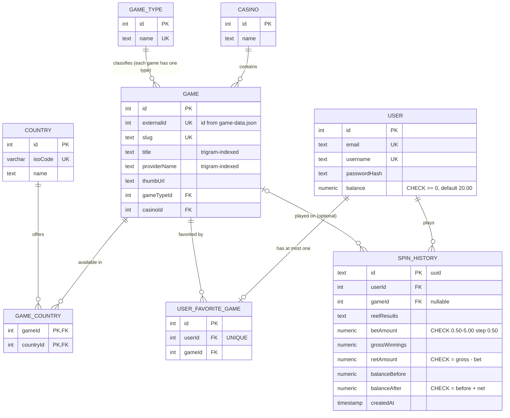

# Good Vibes Casino — Full-Stack Developer Test

A production-style casino platform: game lobby with backend search, JWT authentication, a fully persisted slot machine, and a normalized PostgreSQL schema.

| Layer      | Tech                                                              |
| ---------- | ----------------------------------------------------------------- |
| Backend    | **NestJS 11** (TypeScript, strict), Prisma 6, PostgreSQL 16       |
| Frontend   | **Next.js 16** (App Router, TypeScript), Tailwind CSS 4           |
| Auth       | JWT (Passport), bcrypt password hashing                           |
| Testing    | Jest — unit tests + e2e/concurrency tests against real PostgreSQL |

---

## Quick start

Prerequisites: Node 20.9+, Docker.

```bash
# 1. Database (dev on :5432, disposable test DB on :5433)
docker compose up -d

# 2. Backend — http://localhost:4000/api  (Swagger: /api/docs)
cd backend
npm install
cp .env.example .env          # defaults match docker-compose
npx prisma migrate deploy     # apply schema (incl. indexes & CHECK constraints)
npx prisma db seed            # load the 78 games from game-data.json (idempotent; re-runs update changed game data)
npm run start:dev

# 3. Frontend — http://localhost:3000
cd ../frontend
npm install
cp .env.example .env.local
npm run dev
```

### Tests

```bash
cd backend
npm test          # unit tests (payout engine — every example from the spec)
npm run test:e2e  # e2e vs real Postgres: auth, spins, validation, CONCURRENCY race
```

---

## Where each requirement is answered

| # | Requirement | Implementation |
|---|-------------|----------------|
| Q1 | Game listing from `game-data.json` via REST | Seeded into Postgres (`backend/prisma/seed.ts`), served by `GET /api/games` ([games.service.ts](backend/src/games/games.service.ts)), rendered with `thumb.url` thumbnails on the home page ([page.tsx](frontend/src/app/page.tsx)) |
| Q2 | Search while typing, filtered on the backend | Dedicated `GET /api/games/search?q=` endpoint; frontend debounces input 400 ms and calls it ([page.tsx](frontend/src/app/page.tsx)) |
| Q3 | Auth + slot machine | Register/login/JWT ([auth/](backend/src/auth)), global guard, 20-coin starting balance, transactional spins with full audit trail ([spins/](backend/src/spins)) |
| Q4 | Middleware & security | See [Security](#question-4--middleware--security) below — every item is marked `[Question 4]` in code |
| Q5 | Search optimization | See [Search optimization](#question-5--search-optimization) below |
| Q6 | Currency conversion (display only) | `GET /api/currency/convert?to=` ([currency.service.ts](backend/src/currency/currency.service.ts)) + button on the slot page |
| Q7 | Casino DB design | [ER diagram](#question-7--database-design) below, DDL in [docs/schema.sql](docs/schema.sql), live schema in [schema.prisma](backend/prisma/schema.prisma) |
| Q8 | AI usage disclosure | [Below](#question-8--ai-usage-disclosure) |

HTTP methods used: `GET` and `POST` (requirement: at least two).

---

## Question 3 — Slot machine design

**Reels** are fixed exactly as specified ([reels.ts](backend/src/spins/slot-engine/reels.ts)). Each spin draws one uniformly random symbol per reel using **`crypto.randomInt`** behind an injectable `RandomProvider` — production gets a CSPRNG, tests inject predetermined reel positions so outcomes are deterministic and assertable.

**Payout** ([payout.ts](backend/src/spins/slot-engine/payout.ts)) is a pure function: a win requires a consecutive run starting at Reel 1; only the single highest payout applies. Every example from the spec is a unit test.

**Money semantics** — the spec's "amount won/lost" is stored unambiguously:

- `betAmount` — what the spin cost
- `grossWinnings` — bet × multiplier (0 on a loss)
- `netAmount` = `grossWinnings − betAmount` (the win/loss figure)
- `balanceBefore` / `balanceAfter` = `balanceBefore + netAmount`

All monetary math uses **`Prisma.Decimal`** end-to-end — JS floats never touch money.

**Concurrency safety** — a spin runs inside a transaction that locks the user row (`SELECT … FOR UPDATE`), checks the balance on the locked row, deducts, draws, credits, and writes the `SpinHistory` record atomically. Two simultaneous spins serialize; the e2e suite proves that two concurrent 5.00 bets against a 5.00 balance produce exactly one success, one rejection, one history record, and a final balance of 0.00. The database independently enforces `balance >= 0` and the balance-transition equations via CHECK constraints.

---

## Question 4 — Middleware & security

Each item is marked with a `[Question 4]` comment at its implementation site:

| Measure | Where |
|---|---|
| Security headers (`helmet`) | [main.ts](backend/src/main.ts) |
| CORS allowlist (frontend origin only) | [main.ts](backend/src/main.ts) |
| Rate limiting — 100 req/min global, **10/min on register/login**, 30/min on spins | [app.module.ts](backend/src/app.module.ts), `@Throttle` on controllers |
| Global validation of all bodies & query params (`whitelist` + `forbidNonWhitelisted` + transform) | [main.ts](backend/src/main.ts), DTOs throughout |
| Global JWT guard — every route protected unless `@Public()` | [jwt-auth.guard.ts](backend/src/auth/jwt-auth.guard.ts) |
| Consistent error envelope, no stack leaks | [all-exceptions.filter.ts](backend/src/common/filters/all-exceptions.filter.ts) |
| Request logging with **credential redaction** (never logs bodies, query strings, `Authorization`, cookies) | [logging.interceptor.ts](backend/src/common/interceptors/logging.interceptor.ts) |
| bcrypt (cost 12); login is timing-equalized (dummy-hash compare for unknown emails) with an identical error message, so neither latency nor text reveals whether an email is registered | [auth.service.ts](backend/src/auth/auth.service.ts) |
| DB CHECK constraints as a last line of defense | [migration.sql](backend/prisma/migrations) / [docs/schema.sql](docs/schema.sql) |
| Frontend: restrictive CSP, `X-Frame-Options: DENY`, exact-host image allowlist | [next.config.ts](frontend/next.config.ts) |

**JWT storage tradeoff (documented decision):** JWTs are stored in `localStorage` for assessment simplicity. An `HttpOnly` cookie would provide stronger protection against token theft through XSS, but cross-origin cookie authentication requires additional CORS (credentialed), `SameSite`/`Secure`, and deployment-domain configuration. Mitigations here: short token expiry (2 h), a restrictive Content-Security-Policy on the frontend, and — decisively — the NestJS `JwtAuthGuard` remains the actual security boundary regardless of client storage.

---

## Question 5 — Search optimization

Layered so repeated keystrokes get progressively cheaper:

1. **Debouncing (client)** — input waits 400 ms before querying; a request is not sent per keystroke.
2. **Request cancellation (client)** — each new query aborts the in-flight one (`AbortController`), so a slow stale response can never overwrite newer results.
3. **Server-side caching** — results cached 30 s keyed on `normalized(query) + page + limit` (`@nestjs/cache-manager`); repeated queries skip Postgres entirely.
4. **Trigram indexes (database)** — `pg_trgm` GIN indexes on the **raw** `title` and `providerName` columns. Prisma's `mode: 'insensitive'` emits `ILIKE '%term%'`, which these indexes accelerate directly (expression indexes on `lower(col)` would *not* be used by that query shape).
5. **Pagination + input hygiene** — `limit` hard-capped at 50, search terms trimmed and rejected beyond 100 chars, unknown query params rejected.
6. **Rate limiting** — global throttle backstops any runaway client.

---

## Question 6 — Currency conversion

Documented assumption: **1 casino coin = 1 EUR** (a coin is otherwise an abstract unit an FX API cannot price). `GET /api/currency/convert?to=GBP` is authenticated, reads the user's stored balance server-side, and returns `{ coinBalance, baseCurrency, targetCurrency, rate, convertedBalance }`. Rates come from the free [Frankfurter](https://frankfurter.dev) API (ECB data), cached server-side for 1 hour, with a 5 s upstream timeout, a strict currency allowlist, and a graceful 503 if the provider is down. **Display only — the stored balance is never modified.**

---

## Question 7 — Database design



- Full `CREATE TABLE` DDL with every PK, FK, index and constraint: **[docs/schema.sql](docs/schema.sql)**
- The live database is built from the identical Prisma migration (`backend/prisma/migrations/`), so the documented design *is* the deployed design.
- Normalization: game metadata lives once in `Game`; type and country relationships are separate entities; favorites are a relation (not a column), enforced one-per-user by a unique index; `SpinHistory` is append-only with internal-consistency CHECKs.

---

## API overview

Interactive documentation: **`http://localhost:4000/api/docs`** (Swagger, supports Bearer auth).

| Method | Endpoint | Auth | Purpose |
|---|---|---|---|
| POST | `/api/auth/register` | — | Create account (starts with 20.00 coins) |
| POST | `/api/auth/login` | — | Obtain JWT |
| GET | `/api/auth/me` | ✅ | Profile + live balance |
| GET | `/api/games?page&limit` | — | Paginated game listing (Q1) |
| GET | `/api/games/search?q&page&limit` | — | Backend search (Q2/Q5) |
| POST | `/api/spins` | ✅ | Play a spin `{ betAmount: 0.5–5.0 }` (Q3) |
| GET | `/api/spins?page&limit` | ✅ | Own spin history, newest first |
| GET | `/api/currency/convert?to=USD` | ✅ | Display-only balance conversion (Q6) |
| GET | `/api/config` | — | Static client config: supported currencies + bet grid |

---

## Project structure

```
├── docker-compose.yml       # Postgres 16 (dev :5432) + disposable test DB (:5433)
├── docs/schema.sql          # Q7 hand-written DDL
├── game-data.json           # source data (also copied to backend/prisma/seed-data)
├── backend/
│   ├── prisma/              # schema.prisma, migrations (incl. raw SQL), seed.ts
│   └── src/
│       ├── auth/            # register/login, JWT strategy, global guard
│       ├── games/           # listing + search (cached, paginated)
│       ├── spins/           # slot engine: reels, RNG provider, payout, transactions
│       ├── currency/        # display-only FX conversion
│       ├── common/          # filters, interceptors, decorators, shared DTOs
│       └── prisma/          # PrismaService
└── frontend/
    └── src/
        ├── app/             # / (lobby+search), /login, /register, /slot
        ├── components/      # header, game card, auth form
        └── lib/             # API client, auth context, types
```

## Testing approach

- **Unit** ([payout.spec.ts](backend/src/spins/slot-engine/payout.spec.ts)): every worked example from the spec, the full payout table, run-must-start-at-reel-1 rules, decimal bet scaling, non-cumulative payouts.
- **E2E** ([casino.e2e-spec.ts](backend/test/casino.e2e-spec.ts)) — runs against a **real PostgreSQL** container (row locking doesn't exist on mocks): registration (20 coins, email normalization, duplicate → 409), login, 401s on every protected route, deterministic win and loss spins with exact balance assertions, insufficient-balance rejection, off-grid bet rejection, over-cap pagination / unknown-param / over-long-query rejection, currency allowlist, and the **concurrency race** described in Q3 above.

## Deployment notes

Built deploy-ready for Vercel (frontend) + Render (backend + managed Postgres): configuration is entirely env-driven (`DATABASE_URL`, `JWT_SECRET`, `CORS_ORIGIN`, `NEXT_PUBLIC_API_URL`), CORS and CSP already parameterized. Deployment itself was out of scope for this stage.

Note: `NEXT_PUBLIC_API_URL` is inlined at **build** time into both the client bundle and the CSP `connect-src` header — set it in the build environment and rebuild the frontend whenever it changes (a runtime-only env change would leave the bundle pointing at the old URL).

---

## Question 8 — AI usage disclosure


